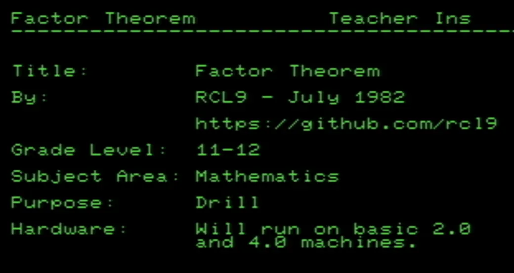
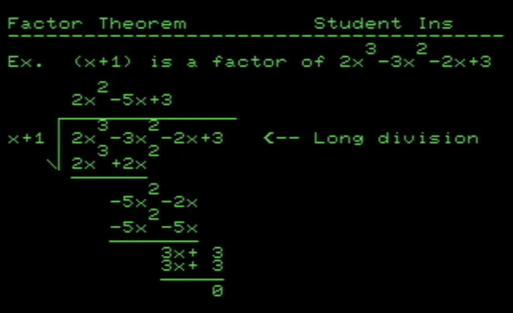
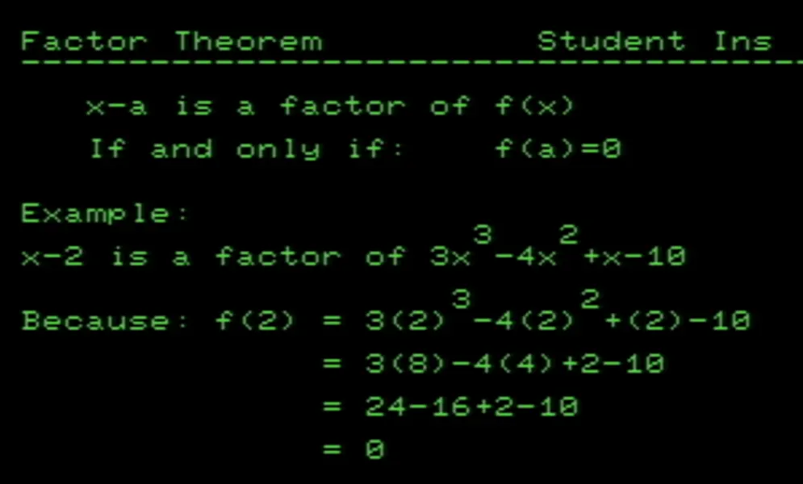
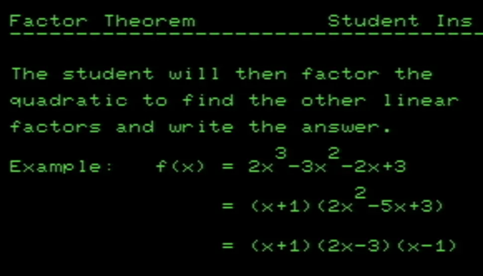
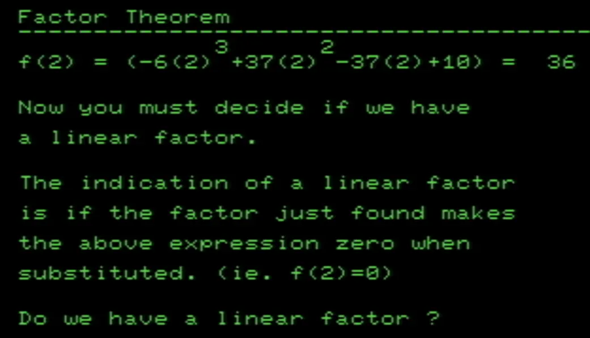
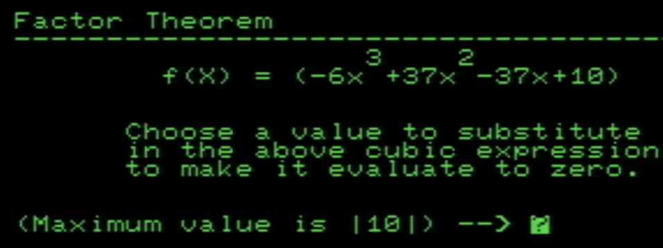

## Factoring of Cubics Using the Factor Theorem 

This PET program provides instruction, drill and review in the factoring of cubics, using the factor theorem. The cubics are generated randomly but will always be in the form of:

$(x-a)(bx-c)(dx-e) where |a| <= 6$

 

 

 

 

 

 

