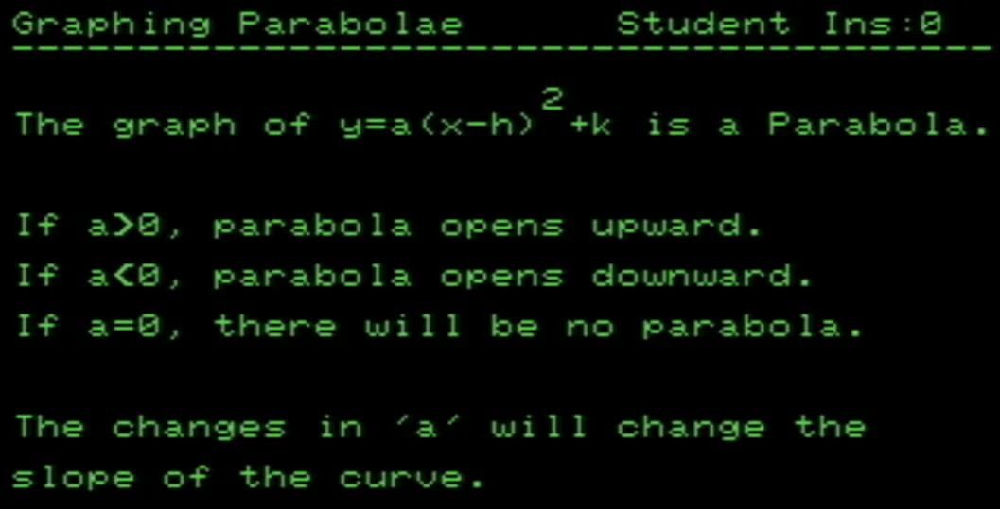
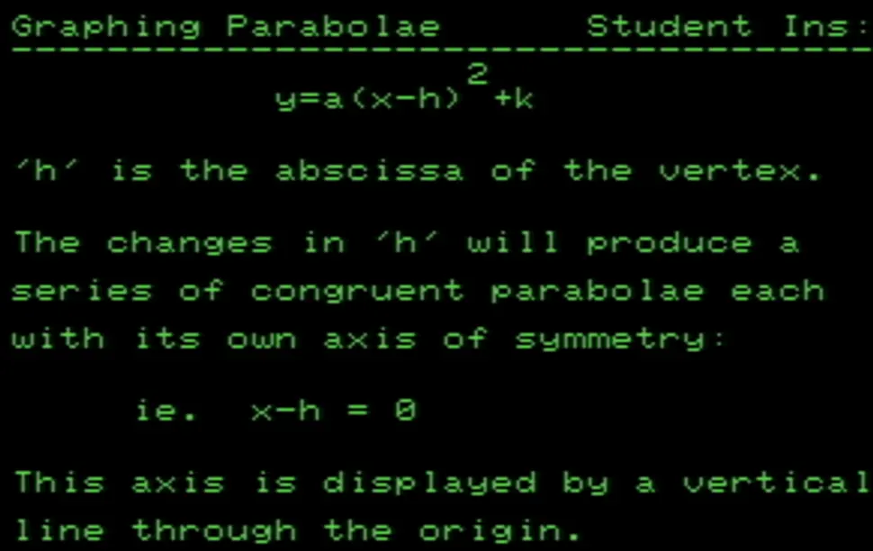
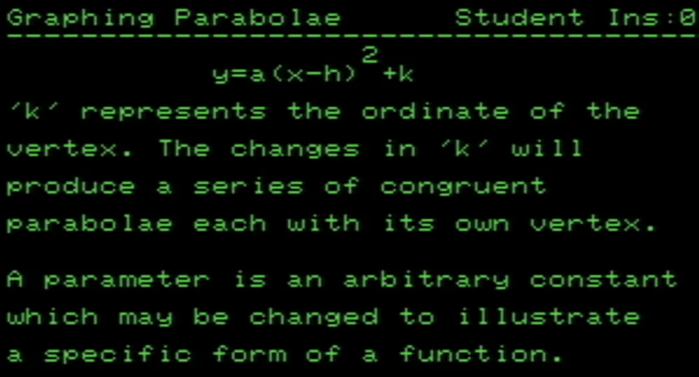
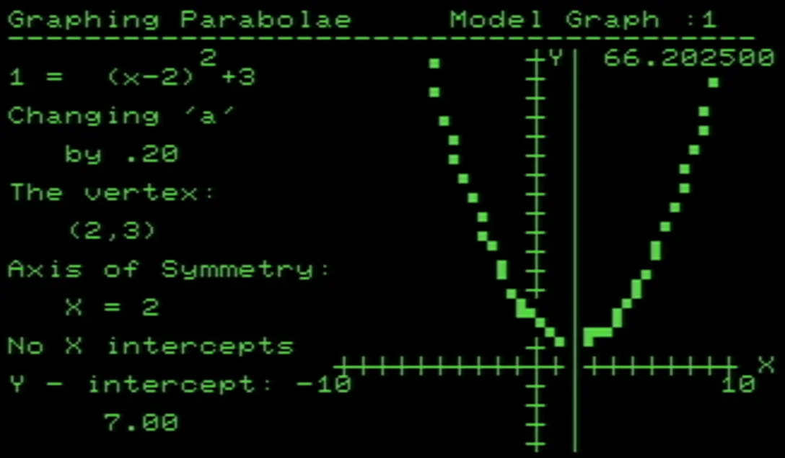

## Graphing the Parabola

This PET program demonstrates the effect of varying the parameters a, h and k in the equation:

$y = a(x-h)^2 +k$

The student can choose any values for the parameters within these limits:

|a| >= 0.1, |h| >= 0.5 and |k| >= 0.1

  

  

  

  

 

